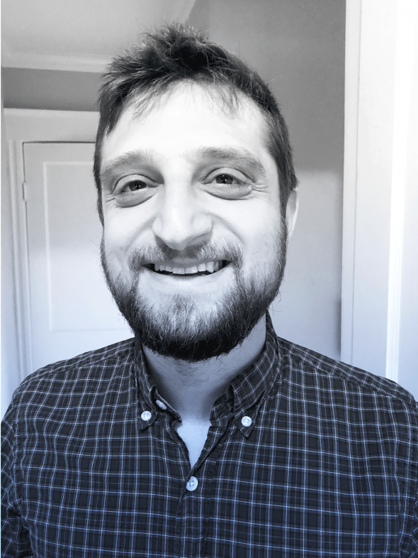

# [35 Innovators Under 35 in 2018](https://www.technologyreview.com/lists/innovators-under-35/2018/)

**W**e’ve been presenting our list of innovators under 35 for 18 years, long enough to spot some trends. You won’t find a lot of artificial-intelligence innovation in the early days of the list, but AI now dominates. And the list has grown more gender equitable. It was once male-dominated, but this year, for the first time, it includes more women than men. We hope the list gives you a sense of what’s coming next, and what kinds of people are making it happen.

## Inventors	
They’re building the technologies of the future, from stretchy electronics to new ways to test cancer drugs.

### James Dahlman, 31     

 * Georgia technologies

**His method makes it possible to test 300 drugs at once.**

**F**or decades, the pharmaceutical industry’s approach to finding new cancer therapies has been to put tumor cells in a dish and test drug-delivering nanoparticles (particles between one and 100 nanometers in size), one by one by one, to find one that’s effective. Then researchers have to hope that those particles go where they’re needed when introduced into a living subject whose body might attack them or break them down.

“The problem is that, forever, people have been testing drug delivery vehicles the wrong way,” says James Dahlman, who runs a lab at Georgia Tech.

Dahlman has invented a radically different process that involves encoding each nanoparticle with a DNA sequence that he calls a bar code. Three hundred of those nanoparticles can be injected into a laboratory mouse, and when researchers remove the tumor, they can use gene-sequencing technology to determine how each of the bar codes did, all at once. The difference in volume is staggering. Dahlman says he tested about 30 particles during his entire PhD; in 2018 alone, his lab will hit 3,000. He hopes this technology could mean that a drug designed to treat a tumor in the lung, for example, could go straight to the problem area—rather than making the patient’s hair fall out.

—Dan Solomon

### Shreya Dave, 30

 * Via Separations

**Her filtration system could eliminate much of the energy used in industrial separation processes.**

Shreya Dave thought her PhD research had no practical applications. It involved molecular filtration membranes made of graphene oxide—which is cheaper and less prone to degrading than the polymers and ceramics used today—but her method was too expensive for the water industry.

Then an article in Nature convinced her that the technique could save massive amounts of energy in the industrial processes used to separate chemicals for food, beverages, drugs, and fuel. These processes, it turns out, account for 12 percent of all US energy consumption.

Dave is now the CEO of Via Separations. The technology she and her team designed is meant to replace the current system for separating chemical compounds, which basically amounts to boiling. Dave believes that widespread adoption of Via’s filtration material could eliminate anywhere from 50 to 90 percent of the energy used in such industrial processes.

Her company is currently focusing on the food and beverage industry, but Dave thinks if she can prove that the technology is scalable and cost-effective in one industry, that will be the key to succeeding in others.

—Dan Solomon

-------------------
### Shinjini Kundu, 27

 * Carnegie Mellon University

**Medical images are so detailed it can be hard to decipher them. Her program can spot what people can’t.**

Medical images are massively important in diagnosing disease, but as they get more detailed it becomes harder and harder for a human being to interpret them. Shinjini Kundu created an artificial-­intelligence system that can analyze them to find patterns undetectable to the naked eye. Her innovation could have a fundamental impact on the way we detect and treat diseases.

“If there are hidden changes and there is a way to detect these invisible patterns, then maybe we have a chance to diagnose diseases early, before symptoms develop,” she says.

There are already AI algorithms that teach themselves to spot patterns, but they’re not able to explain their reasoning. In medical diagnosis, this can be a limitation: without some knowledge of how and why a disease is developing, it’s impossible to address.

Kundu’s system allows humans to look through the eyes of the computer to discover otherwise imperceptible patterns that reveal the early disease process. She also trained the AI to pull out the disease markers from the images so that they can be seen on their own. That could help humans recognize them months or years before the onset of illness—so rather than just humans teaching AI, AI can teach us.

—Erika Beras

------------------

### Barbarita Lara, 32

 * Emercom

**An earthquake led her to invent a blend of analog and digital technologies for use when networks are down.**

When an 8.8 magnitude earthquake hit her native Chile in 2010, Barbarita Lara started tinkering. An engineering student at the time, she was struck by the challenges of communication in the quake’s aftermath: everyone she knew had become dependent on the internet and cell phones, but most networks were down. Along the Chilean coast, 156 people were killed in a tsunami triggered by the quake—in part because they didn’t receive a warning in time.

Eight years later, Lara has a product she thinks can help save lives in the next disaster. Her platform, known by its Spanish acronym SiE, allows smartphone users to receive messages from authorities via encrypted high-frequency audio: a blend of analog and digital technologies designed for use when internet and phone networks aren’t working. The SiE platform, which makes use of existing radio infrastructure, also enables smartphones to message each other using mesh, a radio-enabled wireless ad hoc network. Lara’s invention was inspired by Morse code, which her father, a cryptologist in the Chilean navy, introduced to her when she was a child. “Sometimes the best solution is very simple,” she says.

Emercom, the startup she founded to develop and market the platform, is now in discussions with Chilean disaster management authorities about the prospect of using SiE for future alerts. It’s also in talks with a leading telecom about pre-installing SiE on new cell phones.

—Jonathan W. Rosen

-------

### Will McLean, 31

 * Frequency Therapeutics

**Hearing loss in humans has always been irreversible. His innovation may change that.**

Will McLean believes he’s found a fix for a medical conundrum that many thought could never be solved: hearing loss in humans.

McLean’s research focuses on the cochlea, the spiral-shaped cavity within the inner ear that’s responsible for hearing. At birth, the average human cochlea contains 15,000 hair cells, which detect sound waves and transfer them to the brain. Over time, many of these cells are killed by exposure to loud noise and toxic medications. In mammals, unlike birds, reptiles, and amphibians, they don’t naturally grow back. “The inner ear is one of the least regenerative parts of the body,” McLean says. “That’s why hearing loss is permanent.”

McLean, who holds a PhD from MIT in health science and technology, has spent the last decade trying to change that. His early work showed that the inner ear contains distinct progenitor cells—similar to stem cells but more specific in their capabilities—and that some have the potential to become hair cells, though they cannot divide or differentiate on their own to repair damaged tissue. To resolve this, he and colleagues used insights from regenerative tissues, such as those in the intestine. They exposed damaged cochleas from mice to a combination of drugs that can trigger regeneration in these other organs. Surprisingly, their technique not only caused the progenitor cells to proliferate but also induced them to generate new hair cells—the key to restoring hearing.

On the strength of this discovery, McLean and colleagues established Frequency Therapeutics, a startup working to commercialize what he describes as an entirely new mode of medicine. Frequency’s technique, known as progenitor cell activation, uses a combination of compounds that essentially unlock the body’s ability to heal itself. To date, Frequency has filed 19 patent applications and developed an injectable in-ear therapeutic to combat hearing loss. The treatment has successfully passed human safety trials.

—Jonathan W. Rosen

-----------------

### Manan Suri, 31

 * Indian Institute of Technology, Delhi

His computer chips mimic the workings of the human brain.
Manan Suri has built key elements of computer chips that mimic the learning ability and energy efficiency of the brain. And he did it by harnessing a quirk of next-generation memory technology.

That technology is known as emerging non-volatile memory (eNVM). Because of peculiarities in their nanoscale physics, eNVM devices often behave in random ways, which in computers is usually a flaw. But Suri realized that this irregularity could help researchers build so-called neuromorphic chips, which emulate the neurons and synapses in our brains.

While transistors store information as 1s and 0s, the biological synapses that store information in the brain can take multiple states. That means building computers that behave like the brain traditionally required complicated artificial synapses that can also take multiple states.

Suri recognized that he could harness the inherent variability of eNVMs to build large-scale neuromorphic sys­tems capable of doing supervised and unsupervised learning. He’s exploited that irregular behavior for cybersecurity and advanced sensing applications. Earlier this year he founded a startup, Cyran AI Solutions, to build neuromorphic and cybersecurity hardware based on his eNVM research.

—Edd Gent

--------------
### Sheng Xu, 34

 * University of California, San Diego

**Making off-the-shelf electronics stretchable.**

Stretchy electronics that can conform to the body no longer have to compromise between electrical and mechanical performance, thanks to some smart engineering by Sheng Xu.

Marrying rigid electronic components with elastic materials is tricky. The mismatch in their mechanical properties generates huge strains, causing them to separate when deformed. That’s why most previous research in flexible electronics focused on building new components that are soft and flexible. But Xu didn’t see the sense in discarding decades of progress in the electronics industry. “Why not use something that already matured decades ago?” he says. His strategy made it possible to integrate off-the-shelf components into elastic materials to create highly stretchable electronics as capable as their rigid counterparts.

Xu opted to bond only tiny sections of the components to the elastic material and then support them in a fluid-filled capsule. These are joined together with wires configured into long wavy lines that unravel in an ordered way when stretched. He’s used the approach to build a lithium-ion battery that stretches by up to 300 percent and a hospital-quality health monitor that conforms to the body as it moves. The latter has been developed into a wearable physiological sensor called BioStamp by a startup called MC10.

—Edd Gent

-------------------

### Huanping Zhou, 34

 * Peking University

Her innovations could make better, cheaper alternatives to silicon solar cells.
the solar energy industry has lacked a low-cost, high-performance alternative to silicon for a long time. In recent years, a family of hybrid materials called perovskites has gained attention because they can achieve high power output more cheaply than silicon. But making them work in practice has proved difficult. Early prototypes of perovskite-based solar cells weren’t as efficient as conventional silicon cells at converting the energy in sunlight into electricity.

Huanping Zhou developed a series of chemical processes that made perovskite-based solar cells more efficient and cheaper to produce. If they can be mass-produced, her innovation will make solar power much cheaper.

Growing up in the countryside of China, Zhou did not have electricity at home. She and her siblings did their homework by the light of a kerosene lamp. Her childhood experience motivated her to devote herself to solar technology.

The cell Zhou developed converts more than 20 percent of the energy in sunlight, about the same rate as existing silicon panels. Although some other perovskite cells are more efficient, Zhou’s invention is important because it makes the manufacturing process easier and cheaper. The cells can be produced at temperatures below 302 °F  (150 °C) by spraying or printing a perovskite-based liquid solution onto a substrate such as glass. The process for some other types of perovskite cells requires temperatures around 932 °F.

Perovskite-based solar cells tend to degrade faster than silicon cells, so Zhou is also working on improving their durability.

—Yiting Sun

----------------------

## Entrepreneurs

**Their innovations are creating new businesses and upending the old ways of doing things.**

----

### Natalya Bailey, 31

 * Accion Systems

**A system to propel tiny satellites using electrical energy.**

Natalya Bailey helped develop a way to propel satellites as small as a shoebox or as big as a refrigerator using engines about the size of a dime. It’s based on so-called electrospray propulsion—the idea of using electrical energy to drive small rockets.

Electrospray technology has been in the works for many years. Researchers started studying it in the 1950s, but the work was abandoned because it required very high voltages and because the physics involved was not well understood. Bailey was able to use the technology’s advantages—it’s energy-efficient and doesn’t require toxic propellants or pressurized tanks—to create tiny engines that can be used independently or in tandem with other engines, depending on the size of the satellite.

Bailey founded Accion Systems, just outside Boston, to commercialize the technology. She says the rocket-science field can feel like an old boys’ club but she’s made it work. “Being one of very few women in this field makes me stand out more,” she says. “And I think it probably led to some opportunities that I maybe wouldn’t have had otherwise.”

—Erika Beras

-----
### Jonas Cleveland, 31

 * COSY Robotics

**Helping create the shopping robots of the near future.**

Jonas Cleveland thinks shopping robots will not only be picking goods off the shelves at massive warehouses but roaming the aisles at local businesses, grabbing products for online orders in stores that are also full of human shoppers.

Cleveland’s company, COSY (for Cognitive Operational Systems), is creating the sensor perception system for those robots. Cameras, AI, and mapping technology help make them smart enough to do their job without interfering with the people around them. So if you’re shopping in a pharmacy or home improvement store, Cleveland’s robots won’t bump into you, and if you’ve ordered online for delivery, the robot that prepares your order will know a six-pack of Diet Coke from a six-pack of Coke Zero.

—Dan Solomon

-----
### Elizabeth Nyeko, 34

 * Modularity Grid

**Her energy solution for rural communities in Africa could make grids more efficient everywhere.**

Elizabeth Nyeko thinks she’s found a solution to one of rural Africa’s key development challenges: how to electrify communities in a way that’s affordable—and efficient.

As CEO of Modularity Grid, a London-based startup, Nyeko builds technologies that improve the performance of mini-grids, small-scale electricity generation and distribution systems that power homes and businesses in areas where extending national grids is too expensive. Yet mini-grids also have limitations. As Nyeko learned at Mandulis Energy, a company she cofounded that built a biomass-fired mini-grid in northern Uganda, the electricity demand of individual customers is very hard to track, which typically leads to overproduction of power, inefficient use of fuels, and inflated electricity prices.

At Modularity Grid, Nyeko designed an intelligent cloud-based platform that enables mini-grid operators to better track and predict individual consumption; it then redirects excess electricity to specific users in need of constant power, called “anchor loads.” At the Mandulis site in Uganda, where Nyeko is piloting her Modularity Grid solution, the anchor loads include the village rice mill—which also provides the rice husks used to fuel the mini-grid itself. “If we can deliver just the amount of electricity to people that they need, and redirect the rest to something that creates value for a rural community, we can make mini-grids viable in a low-income setting,” Nyeko says.

Nyeko, who was born in northern Uganda but fled from civil war there as a child, is now marketing her solution to other mini-grid providers and is set to begin work with Total and Vinci Energies on further power projects across Africa. Eventually, she believes, her solution can also help make national grids more efficient—in Africa and beyond.

—Jonathan W. Rosen

-------
### Yin Qi, 30

 * Megvii

**His face-recognition platform transformed the way business is done in China.**

Seven years ago, Yin Qi founded a company called Megvii with two college friends in Beijing. Now people from over 220 countries and regions use Megvii’s face-recognition platform, Face++. The company has more than 1,500 employees.

Face++ has transformed businesses in China, both online and offline. Subways and train stations use face recognition to expedite the screening process; banking apps use it to confirm the identities of their users.

Being in China has given Megvii an edge. While the use of face recognition in the West has mostly been confined to consumer-oriented applications such as unlocking smartphones, in China the same technology enjoyed strong backing from the government and big companies right away. This gives Megvii ample opportunities to commercialize its algorithms for industries as diverse as public security, real estate, finance, and retail.

Yin admits privacy is an issue. He says his products process sensitive raw data on local devices instead of uploading them to the cloud. He’d also like to see an industrywide standard on user privacy. “When there is a good system to manage and run these technologies, the benefits they will bring will outweigh the drawbacks,” he says.

—Yiting Sun

-----
### Ashutosh Saxena, 34

 * Brain of Things

**When his smart speakers didn’t work as well as hoped, he built a better system.**

Ashutosh Saxena is the CEO and cofounder of Brain of Things, which devel­oped an AI system called Caspar that turns a home into a sort of robot that we can talk to and interact with. By later this summer, Caspar will have been installed in about 500 apartments in California and Tokyo.

Each of these apartments is outfitted with around 100 devices including motion and humidity sensors, microphones, cameras, thermostats, and automated appliances. All of these feed data about residents’ behavior to Caspar, which uses a number of algorithms to analyze the data so that it gradually learns and adapts to people’s habits and preferences.

If you tend to ask a lot of questions about the packages you are expecting, Caspar will learn to send you alerts when they arrive. It will also learn to tailor its music playlist to what you are doing at the moment.

When asked whether it’s safe to entrust so many intimate details of our lives to a computer, Saxena says the sensitive raw data generated is stored within the home and not uploaded to the cloud.

The idea of creating Caspar came about in 2015, when Saxena and his roommate took home a couple of smart speakers. These devices, such as the Amazon Echo, can play music, order things online, switch the lights on and off, and do many other things around the house. But the roommates struggled to make the gadgets work the way they wanted them to. The virtual helpers sometimes turned off the wrong light, and when their masters’ schedules changed, they couldn’t adjust their control of other devices accordingly.

So Saxena, a robotics researcher, decided to build a better system.

“You no longer need to worry about packages not arriving at your home,” ­Saxena says. “Caspar notifies you of such things, orders dishwasher soap, or controls your home environment according to your preferences.”

—Yiting Sun

------
### William Woodford, 32

 * Form Energy

**Finding the materials for the next generation of grid-scale batteries.**

For renewables to work, they need batteries—otherwise, the lights go out when the sun goes down or the wind isn’t blowing. Companies like Tesla and Hyundai are addressing the problem by developing football-field-size lithium-ion batteries in Australia and South Korea.

These massive batteries, however, are expensive.

“There’s a cost floor to lithium-ion, which is dictated by the components that are used,” says William Woodford, the chief technology officer of Form Energy. “No matter how cheaply you put it together, you still have a certain set of active ingredients, and those have costs.” So while Elon Musk can build bigger, cheaper batteries, there’s a limit to how cheap they’ll ever get. Lithium carbonate, for example, can cost as much as $20,000 a ton.

To address this problem, Woodford has identified metal-sulfur chemistries that could beat lithium-ion technologies for long-term storage and cost. As a bonus, sulfur is cheap and abundant: it often goes unused as a waste product of oil and gas production.

—Dan Solomon

-------------
### Ji Xu, 33

 * Alipay

**He helped build a payment system that lets anyone with an internet connection use financial services.**

Ji Xu played a key role in building the world’s largest payment platform, which can support more than a billion transactions a day. It’s a boon to commerce, but more important, it enables anyone—especially people without access to traditional banks—to use financial services over the internet.

Originally developed to make payments on Alibaba’s online shopping sites easier and more reliable, Alipay has become a ubiquitous electronic payment app in Chinese e-commerce and brick-and-mortar stores alike. It has 520 million users, who see cash as a thing of the past: whether grocery shopping, paying utility bills, or buying movie tickets, they simply pull out a smartphone and use Alipay to scan a payment code.

As its business grew, Alipay was confronted with two challenges. First of all, it needed to increase the number of transactions it could handle. In addition, it needed to manage a growing variety of funding options. People had started linking all sorts of funds—credit cards, debit cards, electronic cash gifts, and investment portfolios—with Alipay to pay for things, and sometimes one purchase was made using multiple types of funds.

As the chief architect of Alipay’s core payment platform, Xu led a team that increased the system’s capacity from 10 million to 100 million transactions a day, and eventually to one billion. The new system can use servers located anywhere without causing delays during peak hours, which is crucial because the servers consume so much power that no single location can support enough of them to meet the system’s requirements.

The increase in Alipay’s transaction capacity also made it possible to offer online financial services to anyone, regardless of income level. One popular feature of the app lets users invest their leftover cash from online spending in a fund and earn interest at higher rates than they could at a bank.

Growing up near Hangzhou, where the Alipay team is based, Xu was not interested in taking exams. He spent about two years in a computer science program in college before leaving to look for a job, and he joined Alipay at 23. “I wanted to learn technologies,” he recalls. While on the job, he caught up on programming knowledge through online courses.

—Yiting Sun

----------

### Alice Zhang, 29

 * Verge Genomics

**Using machine learning to identify new treatments for Parkinson’s and Alzheimer’s.**

Traditional approaches to drug development for diseases like Alzheimer’s, Parkinson’s, and amyotrophic lateral sclerosis (ALS) haven’t offered patients much. Alice Zhang is trying something new. Her company, Verge Genomics, uses artificial intelligence to identify promising compounds, refining the algorithms with high-quality data from patients and lab tests. She hopes this will be a more effective way to find treatments for intractable neurodegenerative diseases.

Zhang’s unorthodox method was inspired when she heard a researcher give a talk detailing how hundreds of genes interact in cancer and wondered whether this “network” approach could apply to neurodegenerative diseases. “Computational biology has provided so much insight about cancer,” she says. “The brain is about 10 years behind.”

Verge is developing machine--learning models that identify key genes within a disease network and predict which compounds might interfere with their activity. It tests these compounds in animal models and nerves grown from patient-derived stem cells. The company then feeds the results back into the machine-learning model to refine it further. Zhang says seven of Verge’s candidate compounds for ALS have slowed cell death in patient neurons in vitro.

—Katherine Bourzac

--------------

## Visionaries

**They look at things in new ways, unlocking powerful and sometimes unconventional uses of technology.**

----

### Shehar Bano, 31

 * University College London

**She made state censorship beatable by revealing the technology it relies on.**

Shehar Bano made it possible to fight state censorship of the internet—by pioneering the first systematic study of how it happens.

It all started when Bano’s homeland of Pakistan blocked YouTube in 2012. “Previously, people were under the delusion that this was magic,” she says of the inner workings of such restrictions. But she wanted to understand—and defeat—them.

So Bano probed three years of ISP data from Pakistan, and she experimented with ways to circumvent China’s Great Firewall. What she found was a variety of relatively basic technical restrictions, such as censors looking for any request to load a specific website and then sending signals to both the website’s servers and the surfer’s browser to end the request. Understanding this let her devise ways around the restriction without resorting to encryption, like sending an initial, fake request that the censor would see but ignore because of a misspelling—allowing the real request to slip through in the meantime.

Bano not only analyzed online censorship; she also looked into how users of anonymization and security software like Tor and ad blockers are treated differently from unprotected surfers, whether that means a worse user experience or an outright ban.

Bano has joined a wave of computer scientists working to protect the freedom of online communication. As a postdoc at University College London, she’s increasingly working with blockchain-based systems, like the smart-contract platform Chainspace, to improve online security and transparency by allowing transactions that are difficult for outside parties to monitor.

—Russ Juskalian

----
### Niki Bayat, 32

 * Aesculatech

**She invented materials that can heal eyes by sealing up traumatic injuries.**

Growing up in Iran, Niki Bayat always wanted to use her aptitude in engineering to help people suffering from disease—especially after her father developed glaucoma and was unable to have eye surgery because of other health issues. She placed eighth in Iran’s countrywide university entrance exams and majored in chemical engineering at the country’s top university. For grad school, she set her sights on the University of Southern California and joined a collaboration between the labs of renowned chemist Mark Thompson and Mark Humayun, who developed the first artificial retina. “I convinced them that I could bridge the gap between polymer chemistry and biomedical engineering,” she says.

She did just that, using her chemical engineering expertise to develop materials that can help repair traumatic eye injuries and deliver ocular therapies. Bayat has created squishy, biocompatible polymers called hydrogels that become extremely sticky at body temperature, adhering as strongly as superglue. In cases of eye injury, they can be injected in the field, quickly sealing the wound to prevent blindness. Then, back at a hospital, a surgeon can flush the sealant with cold saline, remove it, and suture the wound. Bayat has also designed versions of these materials that can release glaucoma medication or antibiotics in a controlled manner.

In 2016, while still working on her PhD, Bayat started AesculaTech to commercialize these drug-delivering materials, which can be inserted into the tear ducts and release medication over periods of months—potentially preventing the need for patients to apply eye drops multiple times a day. AesculaTech plans to first seek approval for polymer devices to treat dry eye before trying to introduce drug-releasing versions. Her ultimate goal, she says, is to come up with a new and better treatment for glaucoma.

—Katherine Bourzac

----
### Marzyeh Ghassemi, 33

 * University of Toronto

**Using AI to make sense of messy hospital data.**

After collaborating with doctors in the intensive care unit at Beth Israel Deaconess Medical Center during her PhD studies, Marzyeh Ghassemi realized that one of their biggest challenges was information overload. So she designed a suite of machine-learning methods to turn messy clinical data into useful predictions about how patients will fare during a hospital stay.

It wasn’t easy. Areas where machine learning excels typically have huge, carefully labeled data sets. Medical data, on the other hand, comes in a bewildering variety of formats at erratic frequencies, ranging from daily written doctors’ notes to hourly blood tests to continuous heart-monitor data.

And while vision and language tasks are innately easy for humans to grasp, even highly trained medical specialists can disagree on diagnoses or treatment decisions. Despite these challenges, Ghassemi developed machine-learning algorithms that take diverse clinical data and accurately predict things like how long patients will stay in the hospital, how likely they are to die while there, and whether they’ll need interventions such as blood transfusions or ventilators.

This fall Ghassemi joins the University of Toronto and the Vector Institute, where she’s hoping to test her algorithms at local hospitals.

—Edd Gent

----
### Archana Kamal, 34

 * University of Massachusetts, Lowell

**She solved a big problem in quantum computing by shrinking the components.**

As quantum computing starts to move from the lab to the factory, companies from Google to Intel are struggling to solve a tricky problem: how to faithfully steer the quantum information such systems spit out to traditional computers. Doing so is important since quantum systems, which are expected to have a profound impact on cryptography and other fields, will probably be useful only if regular computers can read their calculations.

Archana Kamal, an assistant professor at UMass Lowell, solved the problem. Kamal demonstrated that quantum information could be steered and amplified for transmission before leaving the device where it was processed. Previously, the transmission required large magnets and complicated devices too big to fit on a single chip, leading to data latency and loss, a major impediment in scaling up current qubit systems.

Kamal’s innovation was to slightly alter the path of the transmission of light signals carrying information so as to shrink the components from the size of a quarter to a few micrometers. “That’s a huge difference,” she says. “Our schemes enable the bulk of quantum signal processing to be done on-chip while preserving the high fidelity of the signals.”   

—Russ Juskalian

----
### Brenden Lake, 31

 * New York University

**Getting machines to learn in the fast and flexible ways that humans can.**

Brenden Lake created an AI program that can learn novel handwritten characters as well as a human can after seeing just a single example. That might seem mundane in a world where AI controls self-driving cars and beats the world’s best Go players. But today’s state-of-the-art deep-learning approaches train on thousands of examples and aren’t great at transferring their learning to new problems. A human who’s shown an unfamiliar object once, on the other hand, will be able to recognize a new example, draw it, and understand its various parts.

So Lake took inspiration from cognitive psychology. Instead of feeding his program thousands of examples of letters, he taught it how handwriting works. He showed his model motion-capture recordings of humans drawing letters from 30 alphabets so it could learn what pen movements are used to make strokes, how many strokes characters typically have, and how strokes are connected. When shown a character from an unfamiliar alphabet, the model can recognize and reproduce that character just as well as a person.

He’s applied the same approach to get machines to recognize and reproduce spoken words after hearing one example, and also to mimic how people creatively ask questions when solving a problem.

Getting machines to learn the way humans do could prove crucial for AI applications where training on big data isn’t feasible. “If we want to have smart robots in the home, we can’t pre-train or pre-program the robot to know everything out of the box,” Lake says. “Children pick up new concepts every day, and a truly intelligent machine must do the same.”

—Edd Gent

----

### Adam Marblestone, 31

 * Kernel

**He wrote the book on how to record every neuron in the brain.**

Adam Marblestone wants to make the brain machine-readable. So he worked out the physical limits of what’s possible in recording brain activity and is now using that knowledge to set technology strategy at Kernel, a startup with $100 million in funding that’s building neural interfaces for humans.

As a PhD student, Marblestone was a lead author of a paper now considered a foundational strategic document for researchers building technology to read brain activity. Using the mouse brain as a model, he identified the engineering problems we’ll have to solve to simultaneously measure the activity of every neuron in the brain.

“It’s all about how do we, in the approaches that we take to studying the brain, somehow try to match the complexity of the brain itself?” he says.

As chief strategy officer at Kernel, he’s marshalling a network of leading researchers to identify the most promising approaches for making neural interfaces that can help us understand and treat neurological diseases. One day they could even make it possible to merge our brains with machines.

—Edd Gent

----
### Prineha Narang, 28

 * Harvard University

**Her research on materials at the smallest scale could lead to a new generation of technologies.**

Prineha Narang seeks to build technologies by starting small: with the atom.

As an assistant professor of computational materials science at Harvard, Narang studies the optical, thermal, and electronic behavior of materials at the nanoscale. Her research in how materials interact with light and other forms of electro-magnetic radiation could drive innovations in electronics, energy, and space technologies.

Narang’s work builds on decades of advances in nanoscience that have brought the field closer to a long-held goal: the ability to engineer materials atom by atom.

Yet since its emergence in the 1980s, the discipline has focused mainly on nanostructures at or near equilibrium—their lowest state of energy. At the temperatures they encounter in nature, however, most materials are away from equilibrium, in so-called excited states, which remain poorly understood at the quantum level. “There’s so much more we can do with excited states that has just not been tried yet,” Narang says.

By studying these excited states, Narang is developing approaches that could lead to vastly improved materials. Applications could include improved reflectors and lenses for telescopes, lighter cell phones with better cameras, or synthetic fuels designed at the atomic level.

—Jonathan W. Rosen

----
### Menno Veldhorst, 33

 * Delft University

**He figured out how to make workable quantum circuits on silicon—a feat previously considered impossible.**

Menno Veldhorst has invented a faster path to real-world quantum circuits by making it possible for them to be printed on silicon—the way computer chips have been made for decades.

Quantum computers would allow powerful calculations that no traditional computer is capable of, but before Veldhorst’s innovation, it was considered impossible to make semiconductor-based quantum circuits on silicon that would be stable enough for useful computation. These machines—which are governed by the strange physics of subatomic particles—have instead been built with esoteric materials, including superconductors, that are easier to control in their fragile quantum states. The trade-offs: working with such technology is expensive, and producing such circuitry at scale would require entirely new industrial processes.

Veldhorst, a researcher at Delft University in the Netherlands, has found a way forward with the most replicated manmade structure on the planet—the transistor. He was able to demonstrate calculations on the basic units of quantum information, known as qubits, in silicon semiconductors.

Now, thanks to Veldhorst’s breakthrough, Intel is printing hundreds of thousands of such simple systems on the same type of 300-millimeter wafers the company uses to make its conventional chips. This means collaborators at Intel can increasingly spend their time on the microelectronics and algorithms necessary for complete quantum computers rather than working through the basic physics.

What’s most exciting to Veldhorst is that—just as with the transistor and the computer itself—a flood of quantum computers will need to be built just to figure out what they are capable of. His research has allowed just that.

—Russ Juskalian

----

## Humanitarians

**They see technology as a way to bring about a safer, healthier, and more equitable world.**

----

### Hera Hussain, 28

 * Chayn

**Her tech nonprofit makes it easy for women to build a domestic-abuse case without a lawyer.**

Hera Hussain is empowering women around the world via a simple combination of social and technological innovation: enlisting volunteers to crowdsource multilingual online guides covering topics like how to build a domestic-abuse case without a lawyer, or how to identify psychological manipulation.

It all started after Hussain tried to help two friends escape abusive marriages. “You would think in the UK it would be easy to find information about how to get a divorce, how to apply for asylum, what are the laws to apply for child custody,” she says. “But it was frighteningly difficult to get that information.”

In 2013 Hussain founded the open-source, nonprofit organization Chayn in her spare time—to make the missing information easy to find and understand. Today, 70 percent of Chayn’s 400 volunteers are survivors of violence and oppression themselves. Their guides are built largely from crowdsourced research and firsthand experience of the overlapping psychological, cultural, and legal complexities involved in oppression against women.

Hussain says she’s lost count of the times she’s been lectured—mostly by men—that Chayn’s guides shouldn’t be written by people without legal or academic backgrounds. “You get talked down to a lot,” she says. She likes to counter their arguments with the example of a woman from India who for years was trying to figure out how to leave her abusive marriage. All the resources the woman found online were written by Indian lawyers, almost all men, lamenting that women took advantage of divorce laws rather than be dutiful wives.

Hussain continues to push Chayn to harness appropriate technologies to deepen its reach. A new chatbot, for instance, guides visitors to the most relevant information in as few clicks as possible.

—Russ Juskalian

----------

### Mustafa Suleyman, 33

 * DeepMind

**Working to alleviate human suffering through AI.**

Mustafa Suleyman cofounded the AI company DeepMind out of a desire to have as broad an impact on society as possible. AI, he decided, was the fastest way to do it.

Now Suleyman has launched DeepMind Health to build AI that can better diagnose disease, including systems that detect early-stage eye disease and help analyze mammograms. He’s also focusing on how such technology is used by medical clinicians. “The tech community is only just finally catching up in thinking about the ethical impact of these systems,” says Suleyman. For instance, will time-pressed clinicians simply defer to the AI’s top suggestions without critical evaluation? How will such systems be audited? And how can new medical findings take into account implicit biases in old data used to train the AI? “I think this is going to be the year when Silicon Valley and the technology companies come to really accept the incredible social responsibility that such great power carries,” he says.

Last year, Suleyman launched the DeepMind Ethics & Society unit to design systems that anticipate and direct algorithms’ decision-making processes and their impact on society.

“The big pivot that technology companies are going to make,” he says, “is to ask the question: How do we shape these algorithms so they represent the moral choices that we collectively elect to make?”

—Russ Juskalian

------
### Minmin Yen, 29

 * PhagePro

**Cholera kills, and vaccines don’t always work. She created a better solution.**

Cholera affects millions of people annually in the world’s poorest communities. It’s often treated with antibiotics, but they’re not ideal because they harm the bacteria in the gut, and antibiotic resistance is on the rise.

Minmin Yen developed a better solution: bacteriophages, or viruses that specifically target bacteria. What’s significant about Yen’s intervention is that it works immediately to kill the bacteria and prevent the disease from developing. Existing vaccines, in contrast, can take weeks to work.

Yen, who earned a PhD in molecular microbiology at Tufts University, says bacteriophages have been mostly unexplored because antibiotics are so prevalent, but she thinks it’s time for them to play a larger role now that resistant bacteria are so common. She has started a company, PhagePro, to bring her intervention to market.

—Erika Beras

-------------

## Pioneers

**Their innovations are leading the way to better gene editing, smarter AI, and a safer internet.**

----
### Joy Buolamwini, 28

 * MIT Media Lab and Algorithmic Justice League

**When AI misclassified her face, she started a movement for accountability.**

As a college student, Joy Buolamwini discovered that some facial-analysis systems couldn’t detect her dark-skinned face until she donned a white mask. “I was literally not seen by technology,” she says.

That sparked the research for her MIT graduate thesis. When she found that existing data sets for facial--analysis systems contained predominantly pale-skinned and male faces, Buolamwini created a gender-balanced set of over a thousand politicians from Africa and Europe. When she used it to test AI systems from IBM, Microsoft, and Face++, she found that their accuracy varied greatly with gender and skin color. When determining gender, the error rates of these systems were less than 1 percent for lighter-skinned males. But for darker-skinned female faces, the error rates were as high as 35 percent.

In some cases, as when Facebook mislabels someone in a photo, such mistakes are merely an annoyance. But with a growing number of fields coming to rely on AI—law enforcement is using it for predictive policing, and judges are using it to determine whether prisoners are likely to reoffend—the opportunities for injustice are frightening. “We have to continue to check our systems, because they can fail in unexpected ways,” Buolamwini says. 

A former Rhodes scholar and Fulbright fellow, she founded the Algorithmic Justice League to confront bias in algorithms. Beyond merely bringing these biases to light, she hopes to develop practices to prevent them from arising in the first place—like making sure facial-recognition systems undergo accuracy tests.

—Erika Beras

----
### Alessandro Chiesa, 30

 * University of California, Berkeley

**A cryptocurrency that’s as private as cash.**
For all the promise of blockchain, there’s a problem that comes with treating all transactions as public information: some of that stuff is just nobody’s business. But with Zcash, a cryptocurrency cofounded by Alessandro Chiesa, transactions can be not only secure but as anonymous as handing someone a $20 bill from your wallet.

That’s because Zcash employs a cryptographic protocol called a succinct zero-knowledge proof (see “10 Breakthrough Technologies 2018: Perfect Online Privacy”)—that is, an efficient way to convince both parties to a transaction that something is true without divulging any other information.

Zcash has huge implications for transactions that might otherwise reveal a buyer’s or seller’s location, medical information, or other private data. It allows people to do transactions online without risking their privacy or exposing themselves to identity theft. Zcash, which Chiesa launched four years ago, now has a market cap of over a billion dollars.

—Dan Solomon

----
### Chelsea Finn, 25

 * Berkeley Artificial Intelligence Lab

**Her robots act like toddlers—watching adults, copying them in order to learn.**

Chelsea Finn is developing robots that can learn just by observing and exploring their environment. Her algorithms require much less data than is usually needed to train an AI—so little that robots running her software can learn how to manipulate an object just by watching one video of a human doing it.

Finn’s robots act like toddlers, watching adults do something and copying them. A wooden shape-sorting toy in her lab shows evidence of the process: marks from where a robot repeatedly bashed a red cube before learning to place it inside the square hole.

Her ultimate goal is to create robots that can be sent off into the world and acquire a general set of skills—not because they’ve been programmed for those tasks but because they’ve been taught to learn by observing. This might mean factory robots that wouldn’t have to be trained by teams of engineers, or AI systems that recognize objects without being trained on labeled images.

Finn thinks a good intermediate goal for her robots is to teach them how to set the table. The first step is to make robots that can learn how to arrange multiple objects. “In many ways, the capabilities of robotic systems are still in their infancy,” she says. “The goal is to have them gain common sense.” 

—Katherine Bourzac

----

### Alexandre Rebert, 28

 * ForAllSecure

**He asked, what if a computer could fix itself?**

When a computer system gets hacked, people typically fix the problem after the fact. Alexandre Rebert created a machine that can fix itself as the attack is happening.

Rebert recognized that computers may lack creativity, but they’re good at doing things quickly and on a massive scale. His system, called Mayhem, can analyze thousands of programs simultaneously, doing in a few hours what might take a human expert years to accomplish.

Mayhem, an autonomous system, does this by combining two techniques. The first is called coverage-based fuzzing—a standard in automated security testing, in which data is thrown at a program to see if an input triggers new behavior. It’s essentially scanning and searching in a fast way. The second, symbolic execution, analyzes the program in a slower, more nuanced way. The approaches complement each other, making the combination better than other techniques.

Rebert led the team creating Mayhem while working with ForAllSecure, the Pittsburgh-based cybersecurity company he cofounded. The company’s work and mission stem from his research at Carnegie Mellon. He thinks his invention could be especially useful for vulnerable systems like power grids, hospitals, and banks.

“There is an increasing amount of software in our lives,” says Rebert. “And depending only on human expertise is insufficient and dangerous.”

—Erika Beras

----
### Nabiha Saklayen, 28

 * Cellino Biotech

**She developed a way to edit genes with cheap lasers.**

Gene editing is invaluable in correcting mutations like the one that causes sickle-cell anemia. But biologists need better ways to get DNA and other ingredients into cells. Typically, the gene-editing recipe is introduced by viruses, which can have dangerous side effects, or during electroporation, a technique that uses strong electrical pulses and kills many of the cells in the process.

Lasers offer a gentler alternative, but those methods have had their own drawbacks. The lasers used have typically been very powerful and expensive, and capable of injecting only one cell at a time—too slow for clinical applications.

Nabiha Saklayen’s innovation was to design nanostructured add-ons to the laser system that deliver pulses of laser light to large numbers of cells at once, making it possible to dose them with gene editors at clinically useful speeds. Her process doesn’t require an expensive laser, though it took her a while to convince other researchers and her advisor that relatively cheap ones were powerful enough. “It doesn’t matter to the cell,” she says.

Saklayen has now founded a company, Cellino Biotech, to commercialize her idea and use gene-editing tools to engineer cells.

Trained as a physicist, she is unusually comfortable with moving between scientific fields, including laser physics, nanomaterials, and synthetic biology. She credits her upbringing in Saudi Arabia, Bangladesh, Germany, and Sri Lanka with her adaptability. “I’m comfortable in new places, and at the interface of 
different fields,” she says.

—Katherine Bourzac

----
### Julian Schrittwieser, 25

 * DeepMind

**AlphaGo beat the world’s best Go player. He helped engineer the program that whipped AlphaGo.**

A few years ago, when Julian Schrittwieser joined the Google-owned artificial-intelligence firm DeepMind, the board game Go was often called the Holy Grail of machine learning. The two-player game, which originated in ancient China, was so unconstrained by rules and so driven by intuition that many thought it would take a decade for AI to best the world’s top players. But in March 2016, a program developed by ­Schritt­wieser and his ­DeepMind colleagues defeated South Korea’s Lee Sedol, the world Go champion, in a best-of-five series that drew more than 100 million viewers. Go enthusiasts called it the match of the century.

Schrittwieser and his teammates followed this up with an even more impressive accomplishment. In October 2017, their new program, AlphaGo Zero, defeated the earlier program, AlphaGo, 100 games to zero. Unlike AlphaGo, which learned the game by studying the play of humans, AlphaGo Zero learned by playing against itself—a feat with major implications for artificial intelligence. “With AlphaGo Zero, we see that even in areas where we don’t have human knowledge, we can bootstrap that knowledge and have a system that learns on its own,” Schrittwieser says.

Schrittwieser, an Austrian native, is the lead software engineer on the AlphaGo Zero project. He is also a driving force behind a third DeepMind initiative, Alpha­Zero—a more generalized algorithm that has already mastered Go, chess, and the Japanese board game Shogi. The push toward generalization, ­Schrittwieser says, is key to DeepMind’s quest to build intelligent machines that are independent of human intuition—thereby devising better solutions to problems where the approach might otherwise be inhibited by human biases. Ultimately, he believes, this could lead to entirely new, AI-driven innovations in fields from pharmaceuticals to materials science.

—Jonathan W. Rosen

-----
### John Schulman, 30

 * OpenAI

**Training AI to be smarter and better, one game of Sonic the Hedgehog at a time.**

John Schulman, a research scientist at OpenAI, has created some of the key algorithms in a branch of machine learning called reinforcement learning. It’s just what it sounds like: you train AI agents in the same way you might train a dog, by offering a treat for a correct response. For a machine, the “treat” might be to rack up a high score in a video game.

Which explains why Schulman is so excited about the 1991 video game Sonic the Hedgehog. The game, he says, is a perfect benchmark for testing how well new machine-­learning algorithms transfer learned skills to new situations. Since Sonic is the world’s fastest hedgehog, the game moves rapidly, and it also depicts some interesting physics. Once an AI agent learns how to play, it’s easy for researchers to test its ability to transfer that knowledge to different scenarios.

These algorithms, once trained, might be applied in the real world, and they can be used to improve robot locomotion. Traditional approaches have been specialized for certain situations—which means that on new terrain, a robot programmed using older methods might fall down. One that uses reinforcement learning, ­Schulman hopes, would be able to get back up and try new things until it solves the problem.

—Katherine Bourzac

----

### Humsa Venkatesh, 32

 * Stanford University

**She discovered a secret to cancer growth that could lead to a new class of drugs.**

Humsa Venkatesh’s research revealed how cancers hijack the activity of neural networks to fuel their own growth. Her discovery sparked a novel area of research targeting a type of activity seen in many different types of cancer. “These neuronal systems are signaling inputs that instruct how the tumor grows and functions,” she says. The results could lead to therapies that work against tumor cells in all their diversity.

When Venkatesh was a teenager in California, her uncle, who lived in India at the time, learned he had kidney cancer. Though he sought treatment in both India and the US, the only options available to him were standard radiation and chemotherapy, neither of which was effective. He died less than two years after the diagnosis. The experience made Venkatesh realize how little doctors understood the fundamental mechanisms of tumor growth.

So instead of becoming a doctor, as she’d originally hoped, she devoted herself to studying that. “I wanted my contribution to be not just treating these patients on an individual level, but really advancing cancer research in a way that would help us come up with new ways to treat [them],” she says.

Now Venkatesh is harnessing tumors’ essentially parasitic behavior within their environment to develop drugs that might neutralize the way they exploit neural networks. These therapies could be pushed into clinics faster than some others because prototypes of such drugs already exist—they were developed for other purposes before scientists found out about their potential in cancer treatment.

—Yiting Sun

# Reference

 * [1] https://www.technologyreview.com/lists/innovators-under-35/2018/
